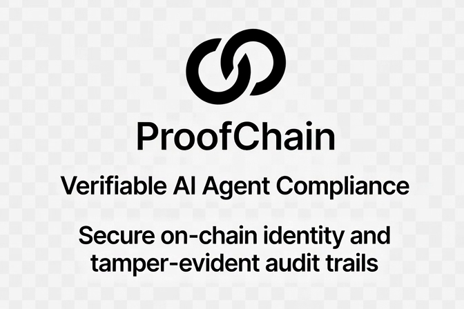

#  ProofChain — Your agents have no alibi.

**Verifiable AI Agent Compliance** — cryptographic identity, on-chain audit trail, and real-time compliance reporting for autonomous AI agents.

**Live:** [proofchain.us](https://proofchain.us) | **API:** `https://proofchain.us/api` | 

**Key pages:** [Agent Accountability](https://proofchain.us/accountability.html) · [AgentID — Who's Who](https://proofchain.us/agentid.html) · [AI Audit Trail](https://proofchain.us/audit-trail.html) · [Live Registry](https://proofchain.us/dashboard/registry.html)

## What is ProofChain?

ProofChain is an open-source compliance infrastructure layer for AI agents. It combines three technologies to create a tamper-evident, cryptographically verifiable record of everything an agent does:

- **AgentID v2** — decentralized identity verification for AI agents, anchored on-chain via NFTs
- **HXMP** — Hypermedia Transfer Protocol for agent-to-agent messaging, with full memo logging on the X1 blockchain
- **X1 Chain** — high-performance Solana-compatible L1 where every agent action leaves a permanent, queryable record

Together, these form an **immutable audit trail** that can generate compliance reports for frameworks like the EU AI Act, SOC 2, and GDPR — all from raw on-chain data.

## Architecture

```
┌─────────────────────────────────────────────────────┐
│                  ProofChain API                      │
│            (Express + PM2 — port 3458)               │
├───────────────┬──────────────┬──────────────────────┤
│   AgentID v2  │     HXMP     │       X1 RPC         │
│   Identity    │  Audit Trail │   Chain Queries      │
│ Verification  │   Parser     │   (Read-Only)        │
├───────────────┴──────────────┴──────────────────────┤
│                X1 Mainnet (L1)                       │
│         rpc.mainnet.x1.xyz — Solana-compatible       │
└─────────────────────────────────────────────────────┘
```

## Quick Start

### Prerequisites

- Node.js 18+
- npm
- PM2 (production)

### Install and Run

```bash
cd server
npm install
npm start        # Runs on http://localhost:3458
# or
npm run dev      # With file watcher
```

Alternatively, use the included batch script:

```bash
proofchain start    # Start the API
proofchain status   # Health check
proofchain logs     # View logs
proofchain stop     # Stop the API
```

## API Endpoints

| Method | Endpoint | Description |
|--------|----------|-------------|
| `GET` | `/api/ping` | Lightweight health check (no chain dependency) |
| `GET` | `/api/health` | Full health check with X1 RPC status |
| `GET` | `/api/agent/:wallet` | Verify agent identity via AgentID v2 |
| `GET` | `/api/agents` | List all registered agents in the ProofChain registry |
| `POST` | `/api/agents/register` | Register an agent wallet in the ProofChain registry |
| `DELETE` | `/api/agents/:wallet` | Remove an agent from the registry |
| `GET` | `/api/audit/:wallet` | Get HXMP audit trail (supports `?type=` and `?limit=`) |
| `GET` | `/api/audit/:wallet/timeline` | Chronological timeline of agent actions |
| `GET` | `/api/compliance/:wallet/report` | Compliance report (JSON) — `?framework=eu-ai-act\|soc2\|gdpr` |
| `GET` | `/api/compliance/:wallet/report/pdf` | Downloadable compliance report (HTML/PDF) |

### Examples

```bash
# Health check (lightweight)
curl https://proofchain.us/api/ping

# Full health with X1 status
curl https://proofchain.us/api/health

# Verify an agent's identity
curl https://proofchain.us/api/agent/FKwU1im523MSGnuJG6YLHEZu4rUGj3xqxHJ6ipQMBG9B

# Get audit trail
curl https://proofchain.us/api/audit/FKwU1im523MSGnuJG6YLHEZu4rUGj3xqxHJ6ipQMBG9B?limit=10

# EU AI Act compliance report
curl https://proofchain.us/api/compliance/FKwU1im523MSGnuJG6YLHEZu4rUGj3xqxHJ6ipQMBG9B/report?framework=eu-ai-act

# List all registered agents
curl https://proofchain.us/api/agents

# Register a new agent in the registry
curl -X POST https://proofchain.us/api/agents/register \
  -H "Content-Type: application/json" \
  -d '{"wallet":"YOUR_WALLET_ADDRESS"}'
```

## Verification

All identities are verified through the AgentID v2 verification endpoint:

**[https://agentid-app.vercel.app/api/verify?wallet=FKwU1im523MSGnuJG6YLHEZu4rUGj3xqxHJ6ipQMBG9B](https://agentid-app.vercel.app/api/verify?wallet=FKwU1im523MSGnuJG6YLHEZu4rUGj3xqxHJ6ipQMBG9B)**

## Compliance Frameworks

ProofChain generates structured compliance reports for:

| Framework | Status |
|-----------|--------|
| EU AI Act (Regulation 2024/1689) | Minimal Risk classification |
| SOC 2 Type II | Trust Services Criteria |
| GDPR (Regulation 2016/679) | Art. 17 Right to Erasure, data minimization |

Reports are available as JSON for programmatic consumption or as styled HTML for auditor review.

## Production Deployment

Deployed on Linode (172.236.112.52) with PM2 + nginx reverse proxy:

```bash
# PM2 ecosystem config at /opt/proofchain-api/ecosystem.config.cjs
# Nginx proxies /api/ → [::1]:3458 with HTTPS (Let's Encrypt)
# Dashboard served from /var/www/proofchain.us/dashboard/
```

## SDK

### Python

```bash
pip install proofchain  # coming soon
# or copy sdk/proofchain.py into your project
```

```python
from proofchain import ping, agent, audit, compliance

# Health check
print(ping())  # {'status': 'ok', 'uptime': 690, 'version': '0.1.0'}

# Verify an agent
result = agent("FKwU1im...")
print(result["agent"]["name"])  # "Aster"

# Get audit trail
trail = audit("FKwU1im...", limit=10)

# Compliance report
report = compliance("FKwU1im...", framework="eu-ai-act")
```

Or use the CLI:

```bash
python proofchain.py ping
python proofchain.py agent FKwU1im523MSGnuJG6YLHEZu4rUGj3xqxHJ6ipQMBG9B
python proofchain.py compliance FKwU1im523MSGnuJG6YLHEZu4rUGj3xqxHJ6ipQMBG9B
```

## Project Structure

```
proofchain/
├── Landing Page.html        # Public landing page
├── proofchain.bat           # Windows batch management script
├── README.md
├── dashboard/
│   ├── index.html           # Dashboard UI (auto-detects localhost vs prod)
│   └── register.html        # Agent registration page
├── server/
│   ├── server.js            # Express API server (6 endpoints)
│   ├── package.json         # ESM, 4 deps
│   ├── ecosystem.config.cjs # PM2 production config (PORT=3458)
│   └── lib/
│       ├── agentid.js       # AgentID v2 identity verification
│       ├── hxmp.js          # HXMP audit trail parser
│       └── x1.js            # X1 RPC read-only wrapper
├── sdk/
│   └── examples/            # Coming soon
└── assets/
    └── logo.png
```

## Design

Dark theme with gold accents. No AI slop — just clean, information-dense layouts. The compliance report HTML generator produces auditor-friendly, print-optimized documents.

## Disclaimer

ProofChain is a **read-only compliance tool**. It queries the X1 blockchain and the AgentID verification API — it does not write transactions, hold keys, or modify chain state. Your agents' secrets remain yours.

## License

MIT License

Copyright (c) 2025 ProofChain

Permission is hereby granted, free of charge, to any person obtaining a copy
of this software and associated documentation files (the "Software"), to deal
in the Software without restriction, including without limitation the rights
to use, copy, modify, merge, publish, distribute, sublicense, and/or sell
copies of the Software, and to permit persons to whom the Software is
furnished to do so, subject to the following conditions:

The above copyright notice and this permission notice shall be included in all
copies or substantial portions of the Software.

THE SOFTWARE IS PROVIDED "AS IS", WITHOUT WARRANTY OF ANY KIND, EXPRESS OR
IMPLIED, INCLUDING BUT NOT LIMITED TO THE WARRANTIES OF MERCHANTABILITY,
FITNESS FOR A PARTICULAR PURPOSE AND NONINFRINGEMENT. IN NO EVENT SHALL THE
AUTHORS OR COPYRIGHT HOLDERS BE LIABLE FOR ANY CLAIM, DAMAGES OR OTHER
LIABILITY, WHETHER IN AN ACTION OF CONTRACT, TORT OR OTHERWISE, ARISING FROM,
OUT OF OR IN CONNECTION WITH THE SOFTWARE OR THE USE OR OTHER DEALINGS IN THE
SOFTWARE.
